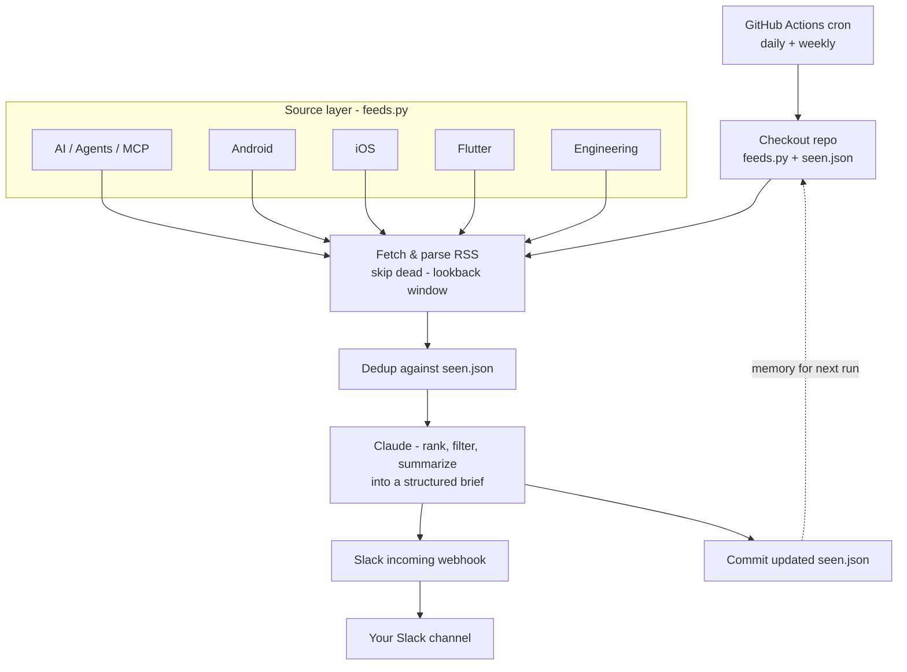

# 📰 Personal Tech News Digest

A free, self-hosted news brief for developers. A scheduled GitHub Action pulls
your favorite RSS feeds, asks **Claude** to rank and summarize what actually
matters — new tools, releases, practices, deprecations — and posts a clean,
grouped digest to your **Slack**. No server, no always-on agent, ~$3/month.

> Fork it, point it at the topics *you* care about (AI, mobile, DevOps, security,
> whatever), add two secrets, and you have your own daily/weekly tech brief.

---

## How it works



Five small layers: a **cron** trigger, an editable **feed list**, a `seen.json`
**dedup** file the workflow commits back as memory, **Claude** as the
rank/summarize brain, and a **Slack webhook** for delivery.

---

## Quick start (~10 minutes)

### 1. Get your own copy
Click **“Use this template” → Create a new repository** (preferred — gives you a
clean repo). Or **Fork** if you plan to contribute feeds back.

### 2. Get an Anthropic API key
- Go to [console.anthropic.com](https://console.anthropic.com) → **Settings → Workspaces** → create a workspace and set a **monthly spend limit** (e.g. $5) so cost is hard-capped.
- In that workspace, **API keys → Create Key**. Copy it.
- Add a little credit under **Billing**. (Note: a Claude **Pro** subscription does **not** include API usage — the API is billed separately.)

### 3. Create a Slack incoming webhook
- [api.slack.com/apps](https://api.slack.com/apps) → **Create New App → From scratch** → name it, pick your workspace.
- **Features → Incoming Webhooks** → toggle **On** → **Add New Webhook to Workspace** → choose your channel → **Allow**.
- Copy the `https://hooks.slack.com/services/...` URL.

### 4. Add the two secrets
Your repo → **Settings → Secrets and variables → Actions → New repository secret** (twice):
- `ANTHROPIC_API_KEY` = your key
- `SLACK_WEBHOOK_URL` = your webhook URL

### 5. Enable Actions + write access
- **Actions** tab → click to enable workflows (forks/new repos start disabled).
- **Settings → Actions → General → Workflow permissions** → select **Read and write permissions** (lets the workflow commit `seen.json` for dedup).

### 6. Make it yours
Edit **`feeds.py`** — keep what you like, delete the rest, add your own. Each line:
```python
{"name": "Source", "url": "https://example.com/rss.xml", "lane": "AI"},
```

### 7. Test it
**Actions** tab → **Tech News Digest** → **Run workflow** → mode `daily`. Check Slack.

### 8. Set your schedule
Edit the `cron:` lines in `.github/workflows/digest.yml` (times are **UTC** — adjust for your timezone).

---

## Customize

| Want to change… | Where |
|---|---|
| Which sources / topics | `feeds.py` (add/remove entries, lanes) |
| A whole new topic (DevOps, Security, Web…) | add a lane in `feeds.py` **and** to the prompts in `digest.py` |
| What gets prioritized / the wording | `SYSTEM_PROMPT`, `DAILY_TASK`, `WEEKLY_TASK` in `digest.py` |
| Cost vs. quality | `MODEL` in `digest.py` — `claude-sonnet-4-6` (sharper) or `claude-haiku-4-5-20251001` (cheaper) |
| How often / how many items | cron in `digest.yml`; `LOOKBACK_DAYS`, `MAX_CANDIDATES`, item counts in `digest.py` |

---

## Cost

- **GitHub Actions** — free tier covers this easily.
- **Slack** — free.
- **Claude API** — the only metered cost. A couple of digests a day on Sonnet is
  cents/day; Haiku is cheaper. The workspace spend limit caps your downside.

Realistically **~$2–5/month**.

---
Example output:


---

## Safety notes

This pipeline is deliberately **read-only and notify-only**: Claude only reads
feed text and writes one Slack message — no terminal, no file access, no
autonomy. Worst case is a noisy digest, not a compromised machine. Two habits:

- **Never put keys in code** — only in repo Secrets / a local `.env`.
- **Respect sources** — only add public feeds; don't scrape paywalled content.

---

## Troubleshooting

- **`missing required env var: …`** → a secret wasn't added, was put under the
  *Variables* tab instead of *Secrets*, or the run started before you added it.
- **Feed shows `skip` in logs** → that URL didn't resolve. Fix or remove it; the
  run continues regardless.
- **Same items repeat** → confirm Workflow permissions are **Read and write** so
  `seen.json` can be committed.
- **Node deprecation warning** → harmless; this repo already uses the current
  `actions/checkout@v6` and `actions/setup-python@v6`.

---

## Contributing

Feed and topic-pack PRs welcome — see [CONTRIBUTING.md](CONTRIBUTING.md).

## License

MIT — see [LICENSE](LICENSE).
